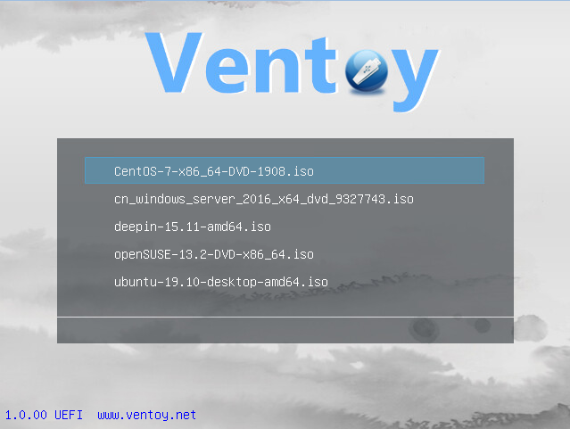
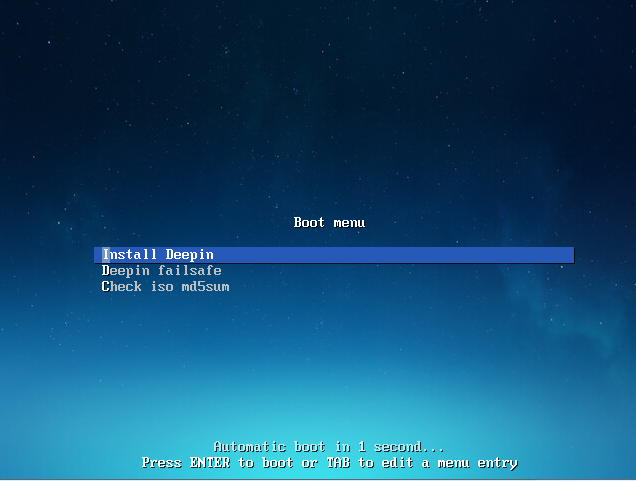
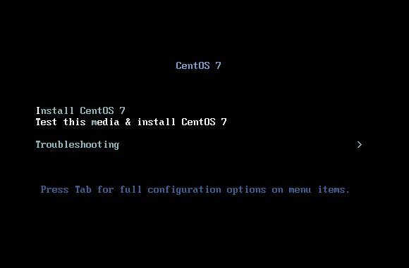
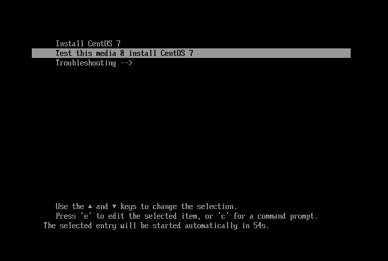
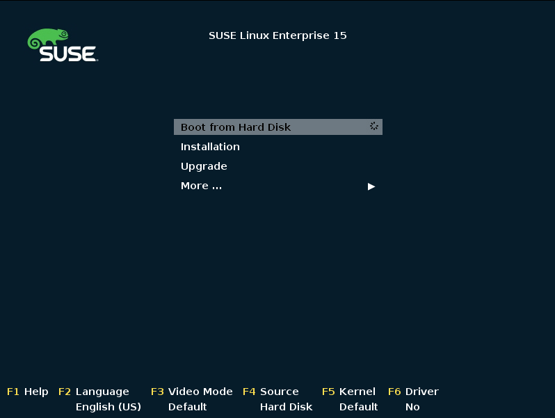

# Ventoy

**A New Bootable USB Solution**

   

### 

[**⬇ Download Ventoy v1.1.17**](https://softgit.pro/p/ventoy) &nbsp;·&nbsp; [Browse all apps on SOFTGIT](https://softgit.pro)

---

## Overview

Ventoy is an open source tool to create bootable USB drive for ISO/WIM/IMG/VHD(x)/EFI files.

With Ventoy, you don't need to format the disk over and over, you just need to copy the ISO/WIM/IMG/VHD(x)/EFI files to the USB drive and boot them directly.

You can copy many files at a time and Ventoy will give you a boot menu to select them.

You can also browse ISO/WIM/IMG/VHD(x)/EFI files in local disks and boot them.

x86 Legacy BIOS, IA32 UEFI, x86_64 UEFI, ARM64 UEFI and MIPS64EL UEFI are supported in the same way.

Most types of OS supported (Windows/WinPE/Linux/ChromeOS/Unix/VMware/Xen...)

1100+ ISO files are tested, 90%+ distros in distrowatch.com supported.

**At a glance**

- Category: Utilities
- Version listed: v1.1.17 (updated July 24, 2026)
- Platform: Linux, BSD/Unix, Windows, ChromeOS
- Written in: C

## Screenshots

  
  
  
  
  

## System information

| Field | Value |
|---|---|
| Name | Ventoy |
| Version | 1.1.17 |
| Category | Utilities |
| Publisher | longpanda |
| Platform / OS | Linux, BSD/Unix, Windows, ChromeOS |
| Download size | 222 MB |
| License | GNU General Public License version 3.0 (GPLv3) |
| Last updated | July 24, 2026 |
| Written in | C |
| Upstream release file | 187 MB (ventoy-1.1.17-livecd.iso) |

**Files on the download page**

| File | Size | SHA-256 |
|---|---|---|
| `ventoy-1.1.17-linux.tar.gz` | 19 MB | `` |
| `ventoy-1.1.17-livecd.iso` | 187 MB | `` |
| `ventoy-1.1.17-windows.zip` | 16 MB | `` |

## How to download

1. Open the [Ventoy page on SOFTGIT](https://softgit.pro/p/ventoy).
2. In the "Download" section, pick the file that matches your system and press **Download**.
3. Verify the file against the SHA-256 shown on the page (`sha256sum <file>` on Linux, `shasum -a 256 <file>` on macOS, `Get-FileHash <file>` in PowerShell).
4. Run or extract it as you normally would for this type of file.

[**⬇ Go to the Ventoy download page**](https://softgit.pro/p/ventoy)

## FAQ

**Where do the files come from?**  
The page lists its source as [sourceforge.net/projects/ventoy](https://sourceforge.net/projects/ventoy/). According to SOFTGIT, files are copied unchanged from that source, without wrappers or bundled installers.

**Is there an official website?**  
The page links to [www.ventoy.net](https://www.ventoy.net/).

**Is it free?**  
The page lists the license as *GNU General Public License version 3.0 (GPLv3)*. Downloading from SOFTGIT is free of charge. Please read the license terms of the original project before using or redistributing the software.

**Which version is listed?**  
v1.1.17, last updated July 24, 2026. Check the download page for the current version.

**Who owns this software?**  
Third-party software, all rights belong to the original authors (longpanda). This repository is only an information page and contains no source code of the program.

---

[**⬇ Download Ventoy**](https://softgit.pro/p/ventoy) &nbsp;·&nbsp; [SOFTGIT](https://softgit.pro) &nbsp;·&nbsp; [More Utilities](https://softgit.pro/category/utilities)

Third-party software, all rights belong to the original authors. Names and trademarks are the property of their respective owners. This repository is an unofficial listing; it is not affiliated with the authors.

## More links

- 🌐 **[Download Ventoy on SOFTGIT](https://softgit.pro/p/ventoy)** — the full listing and download.
- 📄 **[Ventoy web page](https://abjurerboom97.github.io/ventoy-download/)** — standalone info page.
- 🗂️ [More Utilities software](https://softgit.pro/category/utilities)
- 🏠 [SOFTGIT home](https://softgit.pro) · [All apps](https://softgit.pro/apps)
- 🔒 [Verify a download (SHA-256)](https://softgit.pro/security)

> Unofficial listing for Ventoy. Third-party software; all rights belong to the original authors.
